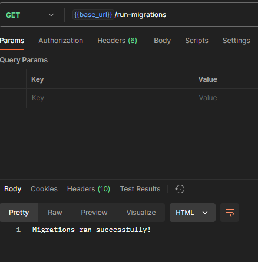
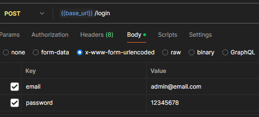
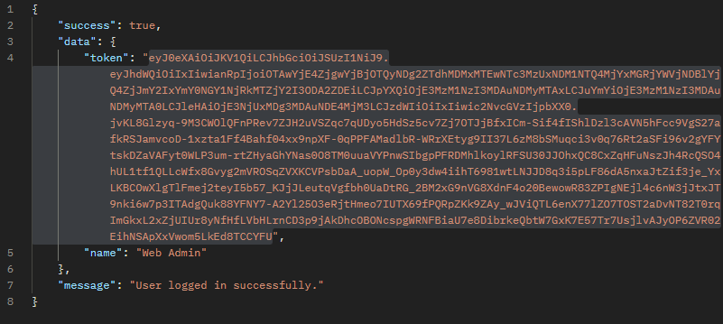
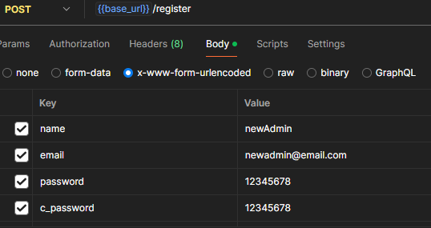
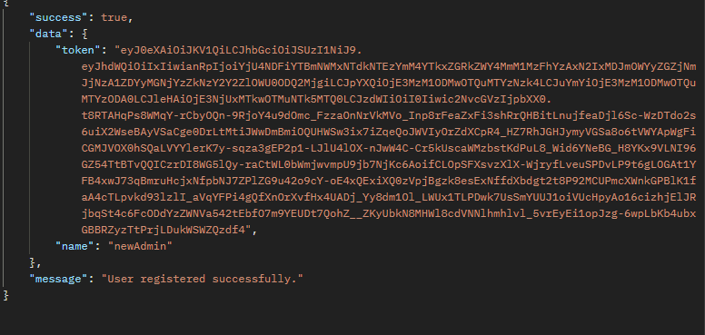

# Api Documentation

## Postman Configuration

### Import Api Collection and Environment Variable
Import the collection nad Environment Variable from the **apicollection** Folder.

## Api Folders and Details

### 1. Configuration (Optional)
---

#### 1.1 Migration Request 
---
You can Run Migration Using this Request
 

#### 1.2 Database Seeder
---
You can Run Database Seeder Using this Request 
 

### 2. Authentication
---
This folder contains User **Login** and **Registration**

#### 2.1 Login
---
Login with **email** and **password**  

#### 2.2 Registration
---
Register with **name** , **email** , **password** and **c_password**  

### 3. User Requests
---
This Folder contains User CRUD Requests
#### 3.1 Add New User
---
Add User with **name** , **email** and **password**  

#### 3.2 All User List
---
View All User  

#### 3.3 Single User Info View
---
Get User info from **ID***  

#### 3.4 Edit User Info
---
Edit User with **ID** in **parameter** and update **name** , **email** and **password**  

#### 3.5 Delete User
---
Delete User with **ID**  

### 4. User Roles
---
This Folder Contains User Role info and Assign Role

#### 4.1 Get All Roles
---
View All Roles  

#### 4.2 View Role Wise Permission
---
View All Permissions of A Role by **ID**  

#### 4.3 User Current Roles
---
View Users Roles by **ID**. Also Shows **Multiple Roles** if User Has  

#### 4.4 Assign User Role
---
Assign roles to user via **user_id** and **role_id**  

### 5. User Permissions
---
This Folder Contains User Permission info and Assign Permissions without assigning any role
#### 5.1 Get All Permission
---
View All Permission  

#### 5.2 Assign User Permission
---
Assign Permission to user with **user_id** and **permission_id**  

#### 5.3 Get User Permission
---
View User All Permission assigned without role  

### 6. Blog Post
---
This Folder Contains BlogPost Related Request

#### 6.1 Add Blog Post
---
Authorized User can create blog with **title** and **body**. Authors id is saved automatically for logged in  

#### 6.2 View All Blog Post
---
Authorized User can view All blogs with **Author(user)**  

#### 6.3 View Single Blog
---
Authorized User Can View Blogs By **Blog Id**  

#### 6.4 Edit Blog Post
---
Authorized User can Edit Blogs **title** and **body**  

#### 6.5 Delete Blog
---
Authorized User can delete post by **ID**  

#### 6.6 Get User All Post
---
Authenticated User can see all his posts 
